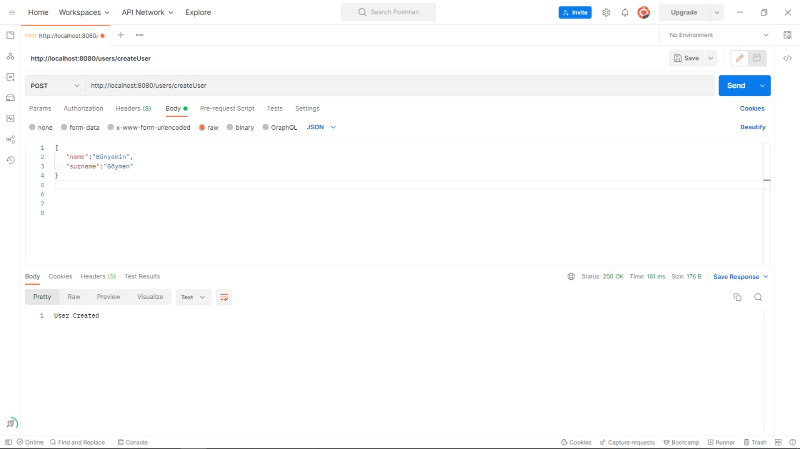
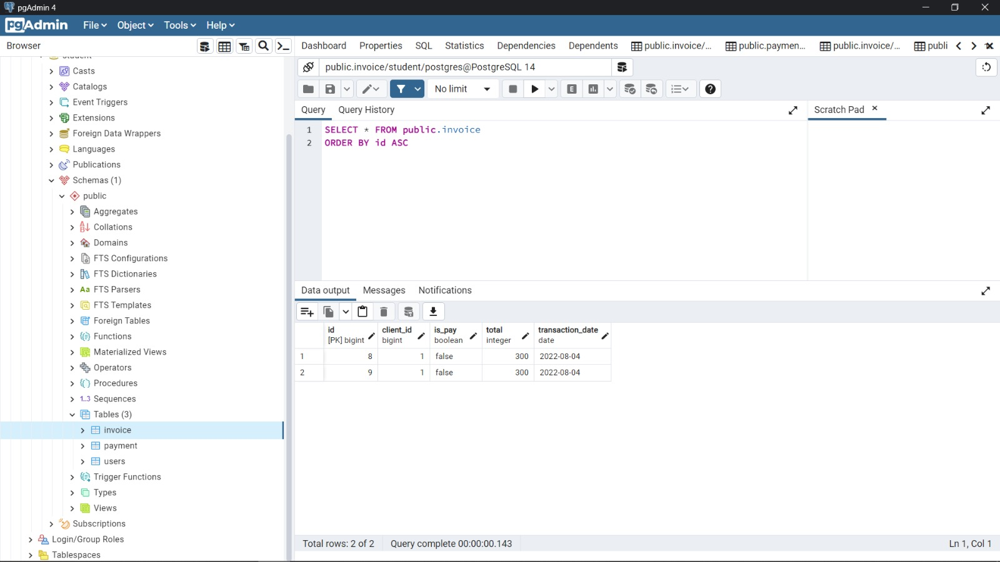

# *
Evam Java Bootcamp Final Projesi
*

## Bölümler:

[ 1- Projenin Açıklaması](#proje) 
[ 2- Veritabanındaki tablo açıklamaları](#tablolar) 
[ 3- Path Açıklamaları](#path) 
[ 4- Postman Kullanımı](#postman) 

### Proje:

● Bir müşteri bilgisi alıp kayıt eden, bir fatura bilgisi kayıt
eden ve bu bilgileri sorgulayan restApi ler olacak.

● Bir de ödenmiş statüsünde gözüken fatura kaydı oluşturalım.
Müşterinin faturası sorgulandığında ödenmemiş faturanın
bulunmadığına dair response code ve mesaj dönülsün. (Fatura
sorgulama faturaId ve müşteri numarası ile yapılmalı)

● Oluşturulan müşteri kaydı ve fatura kaydı için id bilgisi ile
silme işlemleri yapan 2 servis olsun.

● Fatura kaydı oluşturulacak, kayıt sorgulanabilecek.

● Müşteri bilgisi update eden bir servis olacak.

● Bu işlemlerin postgreSql e giden sorgular ile yapacağız.
Respository bağlantısı olmalı.

● Proje bir maven projesi olacak. Springboot framework ü ile ve
SOLID prensiplerine uygun şekilde yazılacak.

3 adet tablo yeterli. Fatura, User, Payment
Payment işlemini doğrudan yapılmış gibi hazır kayıt oluşturulması
yeterli. Servisler ResponseEntity tipinde cevap dönmeli.
Aşağıdaki pathler örnektir, gerektiği kadar servis
oluşturabilirsiniz. Readme dosyasında bu restApi ler için açıklamalı Postman den nasıl
istek atıldığını gösteren örnek Request ve response lar içeren,
GET/PUT/POST/DELETE işlemlerini açıklayan bir açıklama bulunsun.

1. https://localhost:8080/v1/payments/getAllDebts-> list
of debts

2. https://localhost:8080/v1/debts -> create debt -> (the
return type must be Response.class and it should
contains code, date, explanation) and the return code
must be 0, explanation = "The debt is created
succesfully"

3. https://localhost:8080/v1/payments/{debtId} -> update
the debt statu (if it is paid returns 1 and a
explanation like "The debt is allready paid" (the
return type must be Response.class and it should
contains code, date, explanation)

4. https://localhost:8080/v1/payments/{debtId} -> delete
the debt record from table.

5. https://localhost:8080/v1/users/createUser

6. https://localhost:8080/v1/users/queryUserInfo

Class car hangi attribute hakkında ihtiyacınız olan detaylar:

Müşteri için; ad, soyad, abone no

Fatura; fatura no, abone no, fatura tutarı, fatura işlem tarihi

Payment ; amount, date, abone no

### Tablolar

*User* : Kullanıcı bilgilerini tutmaktadır. İçerisinde 3 tane Sütun(Column) bulunmaktadır. Bunlar: id(abone_no), name ve surmane.

*Invoice* : Kullanıcının fatura bilgilerini tutmaktadır. Bir kullanıcının birden fazla faturası olabilir. Bir fatura da sadece bir kullanıcıya ait olabilir. Yani User tablosu ile OneToMany ilişkisi bulunmakta. Örneğin kullanıcının internet,elektrik ve su faturalarının'nın tutarları invoice de ayrı satır(Row) olarak tutulmaktadır.
İçerisinde 5 adet Sütun(Column) bulunmaktadır: id(fatura_no), client_id(abone_no), is_pay, total, transaction_date. client_id, oneToMany ilişkisi için tutulmaktadır. is_pay, faturanın ödenip ödenmediğini tutan bir boolean değerdir. total, faturanın tutarıdır. transaction_date, İşlemin yapıldığı tarihtir.

*Payment* : Bir kullanıcının faturalarının toplam tutarını tutmaktadır. Örneğin bir kullanıcının elektrik faturası: 100, su faturası: 150, internet faturası: 120 olursa. Bu kullanıcının ödemesi gereken toplam tutar 320 tl olmaktadır. Bu durumda Payment bunu tutmaktadır. Her bir kullanıcı için bir Payment satırı olmalıdır. Eğer kullanıcının ödenmmeiş bir faturası yoksa da payment'daki totalAmount değeri 0 olmalıdır. Kullanıcıya ait herhangi bir faturadaki değer değişirse(azalır ya da artarsa), silinirse ya da ödenirse payment değeri de ona göre değişecektir. Her bir kullanıcı için bir Payment değeri olduğu için bu tablo ile kullanıcı arasında OneToOne ilişkisi bulunmaktadır. Aynı zamanda bu tabloya direk kullanıcı tarafından CRUD işlemleri yapılmamalıdır. Invoice ve User tablolarına eklenen veriler ile CRUD işlemi otomatik yapılmalıdır. Örneğin yeni bir fatura eklendiğinde. O faturanın sahibi olan kullanıcının payment değeri değiştirilmelidir. Ya da yeni bir kullanıcı eklendiğinde payment tablosuna da yeni bir değer eklenip totalAmount değeri 0 olarak ayarlanmalıdır (Kullanıcı yeni oluşturulduğu için herhangi bir faturası mevcut değil. Bu sebeple varsayılan totalAmount 0 olarak ayarlı.) İçerisinde 4 adet Sütun(Column) mevcuttur: id, client_id, date, totalAmount.

### Path:

*User* :

  - http://localhost:8080/users/get         -> (Get) Bütün kullanıcıları getirir
  - http://localhost:8080/users/get/{id}    -> (Get) Id değeri girilen kullanıcıyı getirir
  - http://localhost:8080/users/createUser  -> (Post) Yeni bir kullanıcı ekler
  - http://localhost:8080/users/delete/{id} -> (Delete) Id değeri girilen kullanıyı veri tabanından siler
  - http://localhost:8080/users/update/{id} -> (Put) Id değeri girilen kullanıcının bilgilerini gelen bilgilere göre günceller.
  
*Invoice* :

  - http://localhost:8080/invoice/get                      -> (Get) Bütün faturaları getirir.
  - http://localhost:8080/invoice/get/{id}                 -> (Get) Id değeri girilen faturayı getirir
  - http://localhost:8080/invoice/get/clientid/{clientId}  -> (Get) Id değeri girilen kullanıcının faturalarını getirir
  - http://localhost:8080/invoice/createInvoice            -> (Post) Yeni Fatura değeri oluşturulur
  - http://localhost:8080/invoice//delete/{id}             -> (Delete) Id değeri girilen faturayı veri tabanından siler
  - http://localhost:8080/invoice//update/{id}             -> (Put) Id değeri girilen faturanın bilgilerini gelen bilgilere göre günceller
  - http://localhost:8080/invoice//pay/{id}                -> (Put) Kullanıcın faturayı ödemesi sağlanır
  
*Payment* :
  - http://localhost:8080/payment/get                      -> (Get) Bütün Payment'ları getirir.
  - http://localhost:8080/payment/get/{id}                 -> (Get) Id değeri girilen payment'ı getirir
  - http://localhost:8080/payment//pay/{id}                -> (Put) Kullanıcıya ait bütün faturaları ödemesini sağlar (Payment butün faturaların tutarlarını tutuyordu.)

### Postman

 - Proje sıfırdan başlatıldığında bütün tabloları create-drop yapıyor. Bu sebeple daha temiz bir başlangıç oluyor. Aşağıdaki postman'leri de sırasıyla yaptım. Bunun sayesinde aşamalar daha rahat takip edilebiliyor.
 
  
  
 
    İlk olarak bir tane kullanıcı oluşturmak için user/createUser path'ine name ve surname değerlerini içeren JSON formatını gönderiyoruz. User tablosuna ekleme yapıldığında otomatik olarak Paymnet tablosuna da ekleme yapılmaktadır (Aşağıdaki resimlerde payment tablosunun durumuna bakabilirsiniz):
  
 
  
  
 
    3 tane kullanıcı ekleyip user tablosuna get yaptığımızda da aşağıdaki sonuca ulaşırız: 
  
 
  
  
 
    3 tane kullanıcıyı ekledikten sonra veritabanındaki users tablosuna bakacak olursak böyle bir sonuçla karşılaşırız:
  
 
  
  
 
    3 tane kullanıcıyı ekledikten sonra veritabanındaki payment tablosuna bakacak olursak her kullanıcı için otomatik olarak paymnet da da yeni bir değer eklendiğini görürüz. Ancak bu değerler sıfır olacaktır. Çünkü hiçbir kullanıcının ödenmemiş faturası henüz yoktur. Bir kullanıcıya ait fatura eklendiğinde buradaki değerler de güncellenecektir:
  
 
  
  
 
    İlk kullanıcıya ait bir fatura oluşturmak için JSON değerlerini invoice/createInvoice path'ine post olarak yollamamız yeterli olacaktır. client_id değerini de 1 olarak ayarladığımızda ilk kullanıcıya ait fatura eklenmiş olacaktır.:
  
 
  
  
 
    İlk kullanıcıya ait üç tane fatura eklersek ve Invoices tablosuna get yaparsak şu sonuçla karşılaşırız:
  
 
  
  
 
    Invoices tablosuna veritabanından bakacak olursak eklediğimiz faturayı görüntüleyebiliriz:
  
 
  
  
 
     Invoices ekledikten sonra payment tablosuna bakacak olursak da eklenen fatura tutarının payment tablosundaki değerin de güncellendiğini göreceğiz. Çünkü payment tablosu bütün fatura tutarlarını tutmakta. Yeni bir fatura eklendiğinde de o fatura tutarı payment tablosunda da gözükebilmeli :
  
 
  
  
 
      Invoices tablosuna, kendi id'sine göre get yaparsak sadece çağırdığımız id'li fatura gelecektir.:
  
 
  
  
 
      Bir kullanıcıya ait bütün faturaları getirmek istersek client_id'ye göre path'i çağırabiliriz. Böyle yaparak bir kullanıcının bütün faturalarını görüntüleyebiliriz:
  
 
  
  
 
     Bir faturayı silmek istersek delete deyip id değerini verdikten sonra silme işlemini yapabiliriz:
  
 
  
  
 
      Fatura silindikten sonra Invoice tablosuna bakacak olursak silmek istediğimiz değerin silindiğini görebiliriz:
  
 
  
  
 
       Fatura silindikten sonra Payment tablosuna bakacak olursak silinen fatura tutarının payment tablosunda azaldığını göreceğiz. Çünkü paymnet tablosu var olan faturaların toplamını tutmakta. Bu sebple bir fatura silinirse de payment tablosundan da fatura ttuarı kadar azaltma işlemi olmalı:
  
 
  
  
 
        Fatura tablosundan bir faturanın sadece tutarını değiştirmek istersek JSON kısmına sadece total değerini girmemiz yeterlidir. Diğer değerleer null döndüğü için otomatik olarak güncelleme kısmına dahil edilmemektedir. Null olup olmadığını da kod üzerinden kontrol edilmektedir :
  
 
  
  
 
         Fatura tablosu güncellendikten sonra tabloya bakacak olursak da gerekli bilgilerin güncellendiğini görebiliriz:
  
 
  
  
 
         Fatura tablosu güncellendikten sonra payment tablosuna bakacak olursak; Payment tablosu da girilen tutar kadar değişmiş olacaktır. Yani fatura tutarı azaltılıtsa, azaltılan tutar kadar payment tablosundaki değer de azalacaktır. Artırılırsa da artan tutar kadar payment tablosundaki değer arttırılacaktır:
  
 
  
  
 
          Bir faturayı ödemek istersek sadece pay yazıp ödemek istediğimiz id değerini girmekteyiz. Böylelikle veri tabanında güncelleme işlemi yapmaktayız:
  
 
  
  
 
           Bir faturayı ödedikten sonra Invoice tablosuna bakacak olursak ödenen faturanın isPay değerinin true olduğunu göreceğiz:
  
 
  
  
 
           Bir faturayı ödedikten sonra Payment tablosuna bakacak olursak Payment değerinin fatura tutarı kadar azaldığını göreceğiz (Payment tablosu ödenmeken faturaların toplamını tuttuğu için bir fatura ödendikten sonra o faturanın tutarı payment'tan azaltılmalı. Yani payment tablosu update olur):
  
 
  
  

